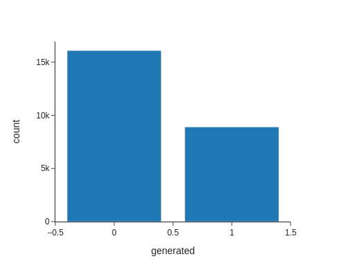
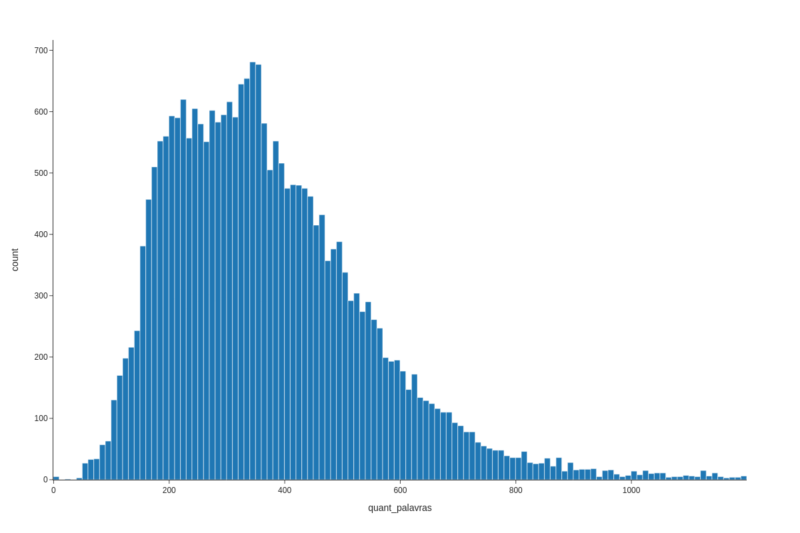
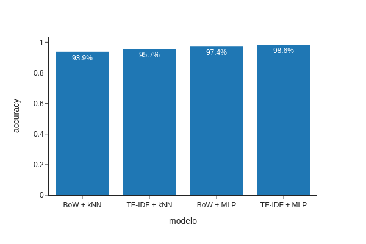

# Diferenciando Textos Humanos de Textos Escritos por Inteligências Artificiais

## Introdução

Com o avanço da Inteligência Artificial (IA), algoritmos sofisticados são capazes de gerar textos que, muitas vezes, se assemelham aos escritos por pessoas. Este projeto tem como objetivo explorar diferentes estratégias de classificação para distinguir entre textos gerados por humanos e por IA. Através da análise de um conjunto de dados composto por textos de ambas as origens, avaliaremos a eficácia de vetorizadores e classificadores para essa tarefa.

## Descrição dos Dados

Utilizaremos 25.000 entradas do dataset [AI vs Human Text](https://www.kaggle.com/datasets/shanegerami/ai-vs-human-text/data).

O dataset possui duas colunas:

- **text**: Guarda o texto;
- **generated**: Indica se o texto foi escrito por um humano ou por uma IA.

Se o texto foi escrito por um humano, a coluna 'generated' possui o valor 0.0. Se foi escrito por uma IA, possui o valor 1.0.

Os dados estão um pouco desbalanceados como podemos ver no gráfico a seguir:

Um dado interessante que podemos tirar dos dados é a quantidade de palavras nos textos. A média de palavras é aproximadamente 376 palavras por texto.

Como pré-tratamento, removeremos acentos, números, caracteres especiais, stopwords, converteremos as palavras para letras minúsculas e faremos uma stemização.

## Metodologia

Faremos a comparação de dois vetorizadores diferentes:

- Bag of Words (BoW);
- Term Frequency-Inverse Document Frequency (TF-IDF).

Junto com os classificadores:

- K-nearest neighbors (kNN);
- Multilayer Perceptron (MLP).

Utilizaremos a precisão (acurácia) para fazer a avaliação dos modelos.

## Resultados

### BoW + kNN

Utilizamos a classe [CountVectorizer](https://scikit-learn.org/stable/modules/generated/sklearn.feature_extraction.text.CountVectorizer.html) para aplicar o BoW. Para este método de classificação, podemos modificar 2 hiperparâmetros para encontrar a melhor configuração.

#### Hiperparâmetros:

Uma busca foi feita em cada um dos seguintes parâmetros utilizando [GridSearchCV](https://scikit-learn.org/stable/modules/generated/sklearn.model_selection.GridSearchCV.html):

**n_neighbors**: O número de vizinhos utilizados para a classificação foi testado entre 1 e 10. O valor ideal encontrado foi 2.

**metric**: A métrica usada no cálculo da distância durante a classificação. Foram testadas as métricas: Euclidiana, Manhattan e Minkowski. A métrica ideal encontrada foi a Euclidiana.

### TF-IDF + kNN

Utilizamos a classe [TfidfVectorizer](https://scikit-learn.org/stable/modules/generated/sklearn.feature_extraction.text.TfidfVectorizer.html) para aplicar o TF-IDF. Para este método de classificação, podemos modificar 2 hiperparâmetros para encontrar a melhor configuração.

#### Hiperparâmetros:

Uma busca foi feita em cada um dos seguintes parâmetros usando [GridSearchCV](https://scikit-learn.org/stable/modules/generated/sklearn.model_selection.GridSearchCV.html):

**n_neighbors**: O número de vizinhos utilizados para a classificação foi testado entre 1 e 10. O valor ideal encontrado foi 9.

**metric**: A métrica usada no cálculo da distância durante a classificação. Foram testadas as métricas: Euclidiana, Manhattan e Minkowski. A métrica ideal encontrada foi a Euclidiana.

### BoW + MLP

Utilizamos a classe [CountVectorizer](https://scikit-learn.org/stable/modules/generated/sklearn.feature_extraction.text.CountVectorizer.html) para aplicar o BoW. Utilizamos a função de ativação _ReLU_ nas 5 camadas de 10 neurônios da rede neural. Treinamos a rede por 150 eras.

### TF-IDF + MLP

Utilizamos a classe [TfidfVectorizer](https://scikit-learn.org/stable/modules/generated/sklearn.feature_extraction.text.TfidfVectorizer.html) para aplicar o TF-IDF. Utilizamos a função de ativação _ReLU_ nas 5 camadas de 10 neurônios da rede neural. Treinamos a rede por 150 eras.

Para as estratégias de classificação testadas, obtivemos as seguintes acurácias:

| Método       | Acurácia |
| ------------ | -------- |
| BoW + kNN    | 93.8%    |
| TF-IDF + kNN | 95.7%    |
| BoW + MLP    | 97.0%    |
| TF-IDF + MLP | 99.0%    |

## Discussão

O resultado atingido foi satisfatório, mas melhorias podem ser alcançadas com modelos mais complexos, que necessitam de hardwares melhores, pois mesmo com os modelos utilizados, foi necessário um grande tempo de execução.

## Conclusão

Essas foram as acurácias das 4 estratégias testadas:

Podemos observar que, para esses dados, não houve grande diferença de desempenho dos modelos baseados nas vetorizações BoW e TF-IDF, mas houve um pequeno aumento de desempenho entre os classificadores kNN e MLP.

Um notebook com todo o código usado nesta análise está disponível no [GitHub](https://github.com/AmonVanderlei/ai-vs-human-text).

## Agradecimentos

Agradecimentos ao Shayan Gerami por coletar dados de múltiplas fontes, juntá-los, remover as duplicatas e disponibilizar os dados utilizados, tornando-os simples de trabalhar.

Esta análise foi feita como parte do curso de Introdução à Inteligência Artificial do Módulo III do [Novo Ensino Suplementar (NES)](novoensinosuplementar.com).

## Referências

Aulas e listas do curso de Introdução à Inteligência Artificial do Módulo III do NES.
